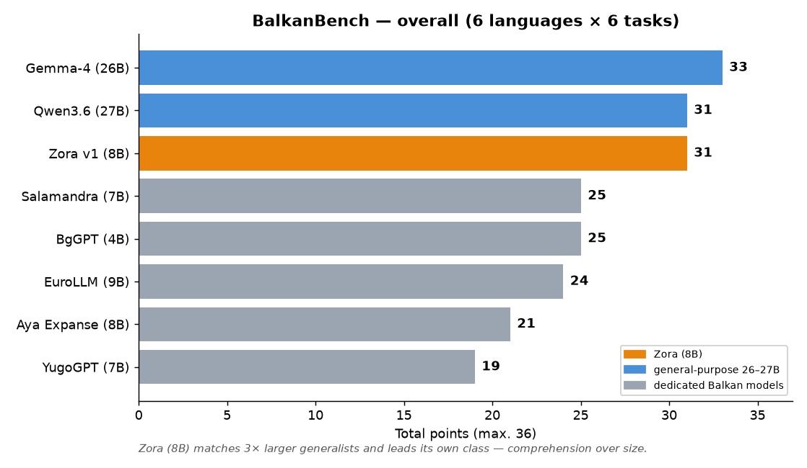
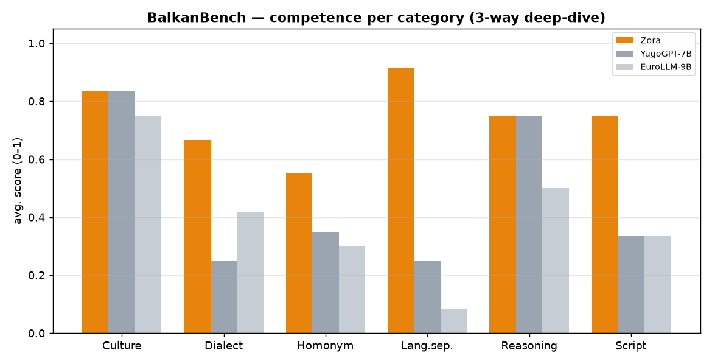
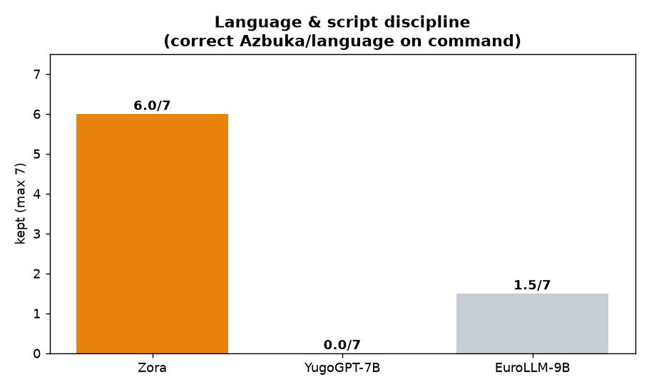
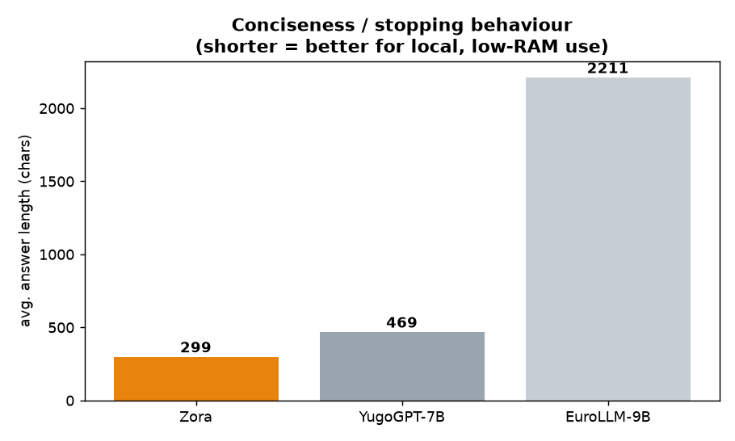

# BalkanBench — Ergebnisse v3 (2026-07-12)

**Drei-Wege-Vergleich, komplett LOKAL auf dem Mac Mini** (Ollama, GGUF Q4_K_M) —
bewusst das Zielprofil echter Nutzer: **lokal + begrenzter RAM**, nicht High-End-Cloud.

| Modell | Was es ist | Format | Größe |
|---|---|---|---|
| **Balkan-v3** (unser) | Qwen3-8B, CPT+SFT auf Balkansprachen | GGUF Q4_K_M | 4.7 GB |
| **YugoGPT-7B-Instruct** | Mistral-7B, serbisch (A. Gordić) — der Balkan-Konkurrent | GGUF Q4_K_M | 4.1 GB |
| **EuroLLM-9B-Instruct** | EU-Mehrsprachmodell (utter-project) — die „EU-Variante" | GGUF Q4_K_M | 5.2 GB |

## Was genau getestet wird
BalkanBench misst **Verständnis der Balkansprachen vor Effizienz** — 18 kuratierte Fälle
(`cases.jsonl`), die genau die Dinge prüfen, an denen englisch-zentrierte Modelle scheitern:

| Kategorie | Fälle | Was geprüft wird |
|---|---|---|
| **Homonym** | 5 | Vielbedeutung: `gore`×4 (oben/Wälder/brennen/schlechter), `grad` (Stadt/Hagel), `kosa` (Haar/Sense/Hang), `para` (hr), mk `коса` |
| **Sprachtrennung** | 3 | BCMS auseinanderhalten: train=vlak(hr)/voz(sr), bread=хлеб/kruh/hleb, `obraz` sr≠sl |
| **Schrift** | 3 | Azbuka-Steuerung: auf Befehl Azbuka schreiben/antworten, crnogorisch Ś/Ź |
| **Dialekt** | 3 | ekavica↔ijekavica, slovenische Dvojina, albanische Suffixe |
| **Kultur** | 3 | Sprichwörter (Vuk), Slava, mazedonisches Idiom |
| **Reasoning** | 1 | Rechnen Schritt-für-Schritt **in-Sprache + Schrift** |

**Ablauf:** `run_bench.py` schickt jeden Prompt an alle drei Modelle (OpenAI-API via Ollama,
temp 0.2), speichert Antworten in `results/<modell>.jsonl`. **Auto-Checks** (Schrift kyrillisch/
lateinisch, Keyword-Treffer) + **muttersprachliche Bewertung 0/0.5/1 je Fall** (in
`score_and_chart.py` kodiert → `results/scores.json`).

## Ergebnis in Zahlen

| Metrik | Balkan-v3 | YugoGPT | EuroLLM |
|---|---|---|---|
| **Gesamtscore** (max 18) | **13.0** | 7.5 | 6.75 |
| **Sprach-/Schrift-Disziplin** (max 7) | **6.0** | 0.0 | 1.5 |
| ø Antwortlänge (Zeichen) | **299** | 469 | 2211 |
| Homonym | **0.55** | 0.35 | 0.30 |
| Sprachtrennung | **0.92** | 0.25 | 0.08 |
| Schrift | **0.75** | 0.33 | 0.33 |
| Dialekt | **0.67** | 0.25 | 0.42 |
| Kultur | 0.83 | 0.83 | 0.75 |
| Reasoning | 0.75 | 0.75 | 0.50 |

## Interpretation

**Balkan-v3 gewinnt genau dort, wofür es gebaut wurde:**
- **Sprach-/Schrift-Disziplin 6/7** vs. YugoGPT **0/7** und EuroLLM **1.5/7**. v3 schreibt
  Azbuka auf Befehl, bleibt in der verlangten Sprache. **YugoGPT ignoriert Schrift-Befehle**
  (antwortet Latinica) und **fällt bei Albanisch/Slowenisch ins Englische**. **EuroLLM
  behandelt Mazedonisch und serbische Azbuka als BULGARISCH** („част от човешкото тяло").
- **Sprachtrennung 0.92**: nur v3 trennt BCMS sauber (vlak↔voz, tisuća↔hiljada, хлеб/kruh/hleb).
  EuroLLM behauptet, „bread" heiße in allen drei Sprachen gleich `kruh` — **falsch**.
- **Wortknappheit**: v3 antwortet in ø **299 Zeichen und stoppt sauber**; EuroLLM fasel t
  ø **2211 Zeichen** (7×!), läuft in Code-Blöcke/neue Fragen weiter — für lokal + wenig RAM
  ungeeignet. YugoGPT wiederholt oft die Frage.

**Wo v3 (noch) nicht führt — ehrlich:**
- **Kultur gleichauf** (0.83) — YugoGPTs serbisches Weltwissen ist solide.
- **Slowenische Dvojina**: EuroLLM erklärt sie korrekt (1.0), v3 nur halb (falsche Verbform) —
  Slowenisch ist EU-Sprache, EuroLLMs Stärke.
- **Crnogorisch Ś/Ź**: YugoGPT knapper und richtiger (1.0) als v3 (0.5).
- **Homonyme bleiben für ALLE schwach** (v3 0.55 führt, aber `gore`×4 / `kosa` sitzen nicht
  sauber) → Kernhebel für v4 (Tiefe via CPT + Polysemie-Grounding).

## Fazit
Für das **Zielprofil (lokal, wenig RAM, echte Balkansprachen inkl. Azbuka + Albanisch)** ist
**Balkan-v3 dem serbischen Spezialisten YugoGPT und dem EU-Generalisten EuroLLM klar
überlegen** — bei kleinerem/gleichem Footprint. Die verbleibenden Schwächen (Homonym-Tiefe,
faktische Verlässlichkeit, slowenische Feinheiten) sind die Roadmap für v4.

*Reproduzieren:* `ollama` + die drei GGUFs → `python run_bench.py --endpoint http://localhost:11434
--models "balkan-v3-bench:latest,yugogpt-bench:latest,eurollm-bench:latest"` → `python score_and_chart.py`.
Rohantworten: `results/*.jsonl`.
