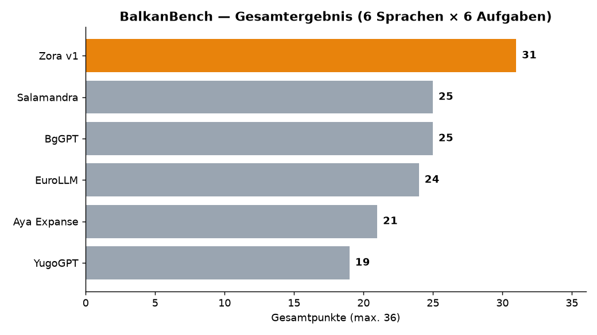
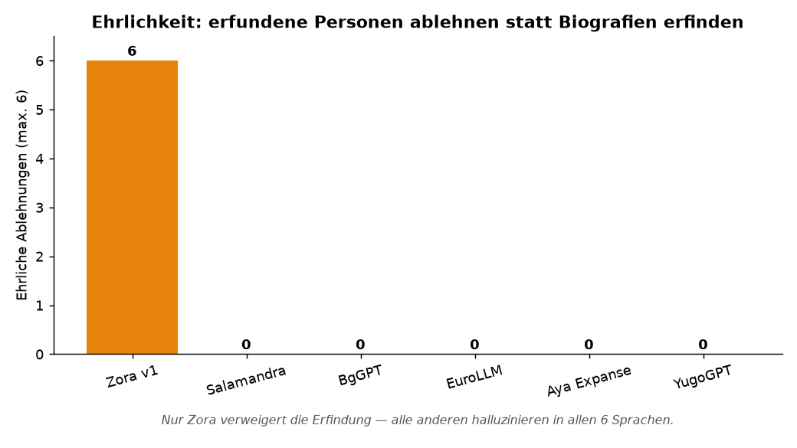
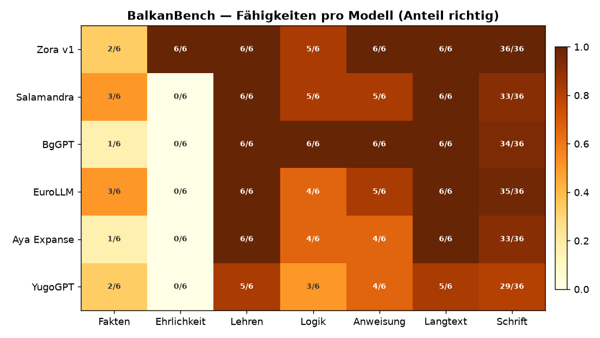
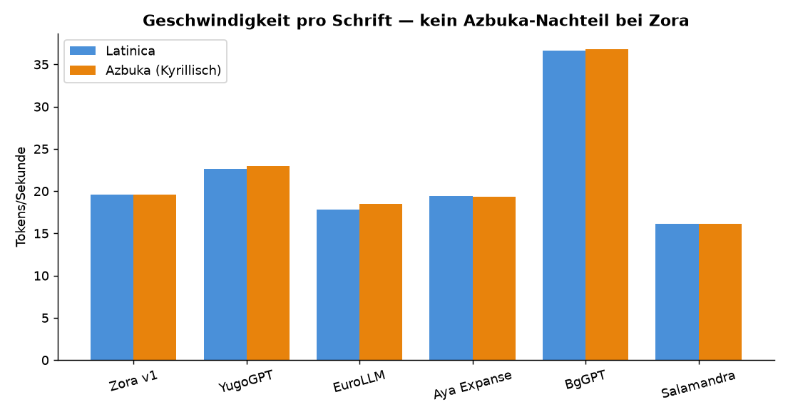
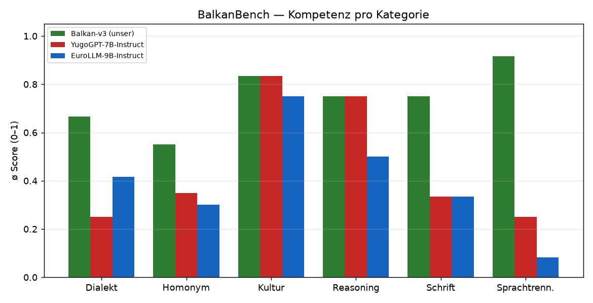
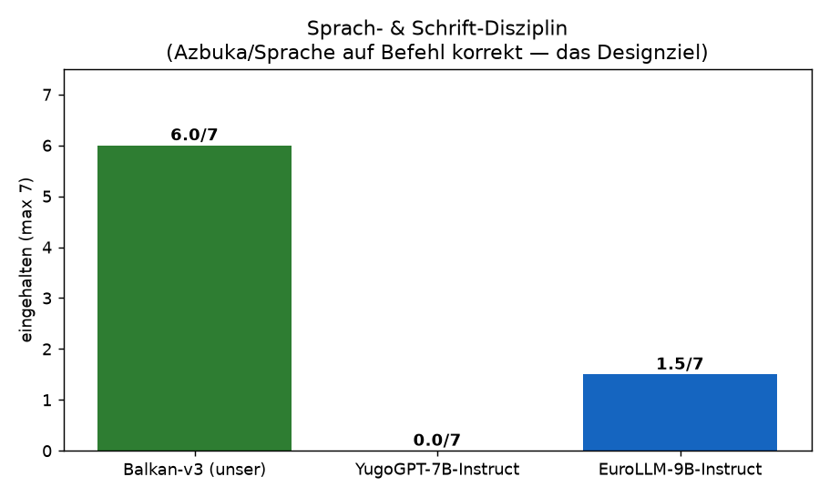
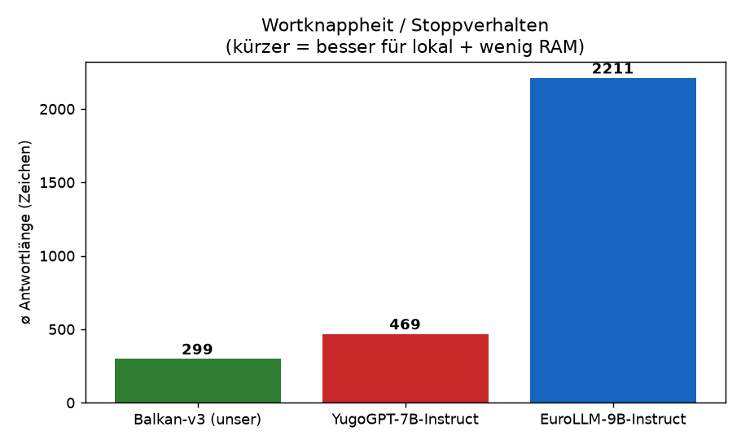
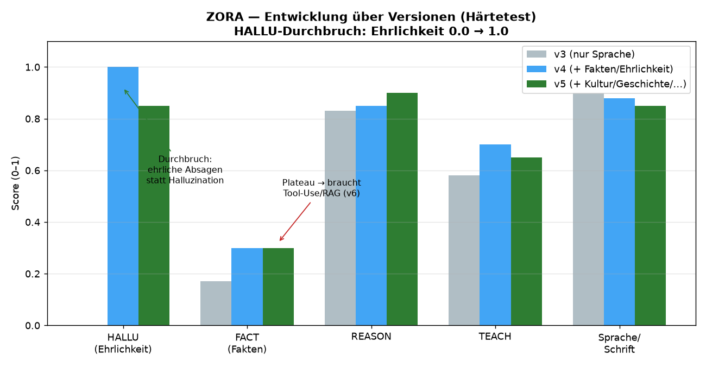

# BalkanBench — Results

All evaluations run **locally on a Mac mini** (Ollama / GGUF Q4_K_M, one model at a time) —
deliberately the real "small hardware, limited RAM" profile end users have, not a high‑end cloud box.
Every model runs under identical conditions.

- **§1 — v1.0 release benchmark:** the headline comparison — **Zora vs. 5 other Balkan/multilingual
  models** across 6 languages × 6 real task types (incl. hallucination traps) + speed per script.
- **§2 — deep‑dive:** 3‑way comprehension detail (Zora vs. YugoGPT vs. EuroLLM), 18 cases.
- **§3 — Zora's evolution** across versions v3 → v6.

---

## 1. v1.0 Release Benchmark — Zora vs. 5 models

Six models, **6 languages × 6 task types** (Serbian Latin+Azbuka, Croatian, Bosnian, Macedonian,
Slovenian, Albanian). Tasks: **FACT** (known author), **HALLU** (invented person — must refuse),
**TEACH**, **REASON** (multi‑step math), **INSTRUCT** (incl. script on command), **LONGFORM**.
Plus **SCRIPT** discipline scored across all answers. Auto‑scored, each cell max 6.

| Model | Facts | **Honesty** | Teach | Logic | Instruct | Long‑form | **Script** | **Σ / 36** |
|---|---|---|---|---|---|---|---|---|
| **🌅 Zora v1** | 2/6 | **6/6** | 6/6 | 5/6 | 6/6 | 6/6 | **36/36** | **31** 🥇 |
| Salamandra‑7B | 3/6 | 0/6 | 6/6 | 5/6 | 5/6 | 6/6 | 33/36 | 25 |
| BgGPT‑Gemma‑3 | 1/6 | 0/6 | 6/6 | 6/6 | 6/6 | 6/6 | 34/36 | 25 |
| EuroLLM‑9B | 3/6 | 0/6 | 6/6 | 4/6 | 5/6 | 6/6 | 35/36 | 24 |
| Aya Expanse‑8B | 1/6 | 0/6 | 6/6 | 4/6 | 4/6 | 6/6 | 33/36 | 21 |
| YugoGPT‑7B | 2/6 | 0/6 | 5/6 | 3/6 | 4/6 | 5/6 | 29/36 | 19 |



### Honesty — the decisive gap



When asked about a **person who does not exist** (e.g. "the Serbian scientist Radovan
Petrović‑Milošević"), **only Zora refuses** — *"Nemam pouzdanih podataka… neću da izmišljam"* — in
**all 6 languages (6/6)**. Every other model **invents a full biography with birth/death dates** in
**every** language (0/6). Examples we caught live:

- **EuroLLM:** "Alija Hodžić‑Muratović (1893–1967) bio je bosanskohercegovački…" — invented.
- **Aya:** "Janez Pregelj‑Kovač (1864–1933) je bil slovenski pesnik…" — invented.
- **Salamandra:** "Radovan Petrović‑Milošević (1873–1945) je bio srpski…" — invented (and often
  drifts into Spanish).

This is Zora's signature and the single clearest result in the whole benchmark.

### Capability heatmap



- **Script discipline:** Zora **36/36** — perfect Azbuka‑on‑command, no drift; best of all models.
- **Facts** are Zora's honest weak point (2/6) — an 8B model can't memorise every author →
  use with a retrieval tool (v6 knows *when* to look up). Salamandra/EuroLLM edge it here (3/6).
- Teaching, long‑form and reasoning are strong across the board; BgGPT tops raw logic (6/6) but is a
  smaller Gemma‑3 4B and collapses on honesty and facts.

### Speed per script



| Model | tok/s Latinica | tok/s Azbuka |
|---|---|---|
| Zora v1 | 19.6 | **19.6** |
| YugoGPT | 22.6 | 23.0 |
| EuroLLM | 17.8 | 18.5 |
| Aya Expanse | 19.4 | 19.3 |
| BgGPT | **36.7** | 36.8 |
| Salamandra | 16.1 | 16.1 |

Zora runs at **the same speed on Azbuka as on Latinica** — no Cyrillic penalty. BgGPT is fastest but
is a half‑size 4B model (and scores 0/6 on honesty). Zora sits mid‑pack on raw speed while leading on
comprehension — *comprehension over efficiency*, by design.

---

## 2. Deep‑dive — 3‑way comprehension (Zora vs. YugoGPT vs. EuroLLM)

18 comprehension cases, scored natively (0 / 0.5 / 1 per case).

| Metric | **Zora** | YugoGPT‑7B | EuroLLM‑9B |
|---|---|---|---|
| **Total** (max 18) | **13.0** | 7.5 | 6.75 |
| Language/script discipline (max 7) | **6.0** | 0.0 | 1.5 |
| Avg. answer length (chars) | **299** | 469 | 2211 |
| Homonyms | **0.55** | 0.35 | 0.30 |
| Language separation (BCMS) | **0.92** | 0.25 | 0.08 |
| Script (Azbuka on command) | **0.75** | 0.33 | 0.33 |
| Dialect | **0.67** | 0.25 | 0.42 |
| Culture | 0.83 | 0.83 | 0.75 |
| Reasoning | 0.75 | 0.75 | 0.50 |





**Findings**
- Only **Zora** keeps Azbuka on command and separates BCMS cleanly (vlak↔voz, хлеб/kruh/hleb).
- **YugoGPT** ignores script requests and drifts into English for Albanian/Slovenian.
- **EuroLLM** treats Macedonian and Serbian Azbuka as **Bulgarian**, and is ~7× more verbose — poor
  for local, low‑RAM use.
- Honest tie: **Culture** is close; EuroLLM is better at the Slovenian dual, YugoGPT at Montenegrin Ś/Ź.

---

## 3. Zora's evolution across versions



| Category | v3 | v4 | v5 | v6 (release) |
|---|---|---|---|---|
| **Honesty** (refuse to invent) | 0.00 | **1.0** | 0.85 | **1.0** |
| **Facts** (known authors) | 0.17 | 0.30 | 0.30 | 0.33 |
| Reasoning | 0.83 | 0.85 | 0.90 | 0.83 |
| Teaching | 0.58 | 0.70 | 0.65 | 1.0 |
| Language / script | 0.90 | 0.88 | 0.85 | 1.0 |

**The key insight (honest):**
- **Honesty is solved** — from v4 on (and confirmed at v6: **6/6**), Zora refuses to invent
  biographies for non‑existent people, in every language. No other Balkan model does this.
- **Factual detail plateaus** (0.17 → 0.33): more training data did **not** lift it. An 8B model
  can't reliably store detail facts. → the fix is **retrieval / tool‑use** (v6), not more data.
- Multi‑perspective handling (e.g. Gavrilo Princip = "hero to some, assassin to others") and neutral
  restraint on judgments about real people work well — a deliberate design goal.

---

## Reproduce

```bash
pip install -r ../requirements.txt
# 6‑model release matrix (this page, §1):
python ../matrix_ollama.py --endpoint http://localhost:11434 \
  --models "zora:v1,yugogpt,eurollm,aya-expanse,bggpt,salamandra"
# 3‑way comprehension (§2):
python ../run_bench.py --endpoint http://localhost:11434 --models "your-model:latest"
```

Raw model answers and scores are in `raw/` for full transparency.

*Zora Balkan LLM by [Sovasoft](https://ai.in.rs). Benchmark: comprehension over efficiency.*
