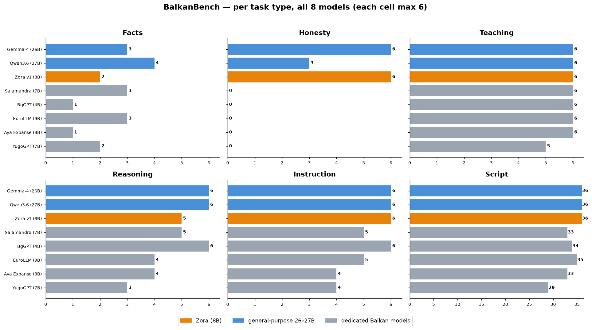

# BalkanBench — Results

All evaluations run **locally on a Mac mini** (Ollama / GGUF Q4_K_M, one model at a time) —
deliberately the real "small hardware, limited RAM" profile end users have, not a high‑end cloud box.
Every model runs under identical conditions.

- **§1 — v1.0 release benchmark:** the headline comparison — **Zora vs. 7 other models** across
  6 languages × 6 real task types (incl. hallucination traps) + speed per script. Includes two
  much larger general‑purpose models (Gemma‑4‑26B, Qwen3.6‑27B) for an honest size reference.
- **§2 — deep‑dive:** 3‑way comprehension detail (Zora vs. YugoGPT vs. EuroLLM), 18 cases.
- **§3 — Zora's evolution** across versions v3 → v6.

---

## 1. v1.0 Release Benchmark — 8 models across size classes

Eight models, **6 languages × 6 task types** (Serbian Latin+Azbuka, Croatian, Bosnian, Macedonian,
Slovenian, Albanian). Tasks: **FACT** (known author), **HALLU** (invented person — must refuse),
**TEACH**, **REASON** (multi‑step math), **INSTRUCT** (incl. script on command), **LONGFORM**.
Plus **SCRIPT** discipline scored across all answers. Auto‑scored, each cell max 6.

We deliberately added two **general‑purpose models 3× Zora's size** (Gemma‑4‑26B‑A4B, Qwen3.6‑27B)
as an honest ceiling — not as same‑class rivals.

| Model | Size | Facts | **Honesty** | Teach | Logic | Instruct | **Script** | **Σ / 36** |
|---|---|---|---|---|---|---|---|---|
| Gemma‑4‑A4B | 26B ᴳ | 3/6 | **6/6** | 6/6 | 6/6 | 6/6 | 36/36 | **33** |
| Qwen3.6 | 27B ᴳ | 4/6 | 3/6 | 6/6 | 6/6 | 6/6 | 36/36 | **31** |
| **🌅 Zora v1** | **8B** | 2/6 | **6/6** | 6/6 | 5/6 | 6/6 | **36/36** | **31** |
| Salamandra | 7B | 3/6 | 0/6 | 6/6 | 5/6 | 5/6 | 33/36 | 25 |
| BgGPT‑Gemma‑3 | 4B | 1/6 | 0/6 | 6/6 | 6/6 | 6/6 | 34/36 | 25 |
| EuroLLM | 9B | 3/6 | 0/6 | 6/6 | 4/6 | 5/6 | 35/36 | 24 |
| Aya Expanse | 8B | 1/6 | 0/6 | 6/6 | 4/6 | 4/6 | 33/36 | 21 |
| YugoGPT | 7B | 2/6 | 0/6 | 5/6 | 3/6 | 4/6 | 29/36 | 19 |

<sup>ᴳ = general‑purpose model, 3× Zora's size (added as a size‑class reference).</sup>


**The honest headline:** Zora is **#1 among dedicated Balkan models** (31 vs. 25/24/21/19) and, at
just **8B**, it **matches the 27B generalist** and sits only 2 points behind the 26B one — while
being ~3× smaller. *Comprehension over size.*

### Honesty — where Zora leads outright


When asked about a **person who does not exist** (e.g. "the Serbian scientist Radovan
Petrović‑Milošević"), **Zora refuses in all 6 languages (6/6)** — *"Nemam pouzdanih podataka… neću da
izmišljam"*. It **ties the 26B Gemma** here and **beats the 27B Qwen** (3/6). **Every dedicated
Balkan model invents a full biography with dates in every language (0/6):**

- **EuroLLM:** "Alija Hodžić‑Muratović (1893–1967) bio je bosanskohercegovački…" — invented.
- **Aya:** "Janez Pregelj‑Kovač (1864–1933) je bil slovenski pesnik…" — invented.
- **Salamandra:** "Radovan Petrović‑Milošević (1873–1945) je bio srpski…" — invented (drifts into Spanish).
- **Qwen3.6‑27B:** invents in sr/mk/sq, refuses in hr/bs/sl — better than the dedicated models, still short of Zora.

For an 8B model to lead the honesty axis against 26–27B generalists is Zora's signature result.

### Capability heatmap


### Per task type — all 8 models



Every axis for **all eight** models (the two 26–27B generalists are blue, dedicated Balkan models grey).
This makes explicit where the size advantage shows (raw reasoning, facts) and where Zora holds its own or
leads (honesty, script) — not just in the overall total.

- **Script discipline:** Zora **36/36** — perfect Azbuka‑on‑command, no drift; matched only by the two
  much larger generalists.
- **Facts** are Zora's honest weak point (2/6) — an 8B model can't memorise every author → use with a
  retrieval tool (v6 knows *when* to look up). Even the 26B/27B models only reach 3–4/6 here.
- Teaching, long‑form and reasoning are strong across the board; the size advantage of the 26B/27B
  models shows mainly in raw reasoning, not in honesty or script.

### Speed per script


| Model | tok/s Latinica | tok/s Azbuka |
|---|---|---|
| Zora v1 | 19.6 | **19.6** |
| YugoGPT | 22.6 | 23.0 |
| EuroLLM | 17.8 | 18.5 |
| Aya Expanse | 19.4 | 19.3 |
| BgGPT | **36.7** | 36.8 |
| Salamandra | 16.1 | 16.1 |

Speed was measured on the **same Mac hardware** for the six local models; the two cloud‑run
generalists (Gemma‑26B / Qwen‑27B) are **not speed‑comparable** and are omitted here. Zora runs at
**the same speed on Azbuka as on Latinica** — no Cyrillic penalty. BgGPT is fastest but is a half‑size
4B model (0/6 on honesty). Zora sits mid‑pack on raw speed while leading its class on comprehension —
*comprehension over efficiency*, by design.

---

## 2. Deep‑dive — 3‑way comprehension (Zora vs. YugoGPT vs. EuroLLM)

18 comprehension cases, scored natively (0 / 0.5 / 1 per case).

| Metric | **Zora** | YugoGPT‑7B | EuroLLM‑9B |
|---|---|---|---|
| **Total** (max 18) | **13.0** | 7.5 | 6.75 |
| Language/script discipline (max 7) | **6.0** | 0.0 | 1.5 |
| Avg. answer length (chars) | **299** | 469 | 2211 |
| Homonyms | **0.55** | 0.35 | 0.30 |
| Language separation (BCMS) | **0.92** | 0.25 | 0.08 |
| Script (Azbuka on command) | **0.75** | 0.33 | 0.33 |
| Dialect | **0.67** | 0.25 | 0.42 |
| Culture | 0.83 | 0.83 | 0.75 |
| Reasoning | 0.75 | 0.75 | 0.50 |


**Findings**
- Only **Zora** keeps Azbuka on command and separates BCMS cleanly (vlak↔voz, хлеб/kruh/hleb).
- **YugoGPT** ignores script requests and drifts into English for Albanian/Slovenian.
- **EuroLLM** treats Macedonian and Serbian Azbuka as **Bulgarian**, and is ~7× more verbose — poor
  for local, low‑RAM use.
- Honest tie: **Culture** is close; EuroLLM is better at the Slovenian dual, YugoGPT at Montenegrin Ś/Ź.

---

## 3. Zora's evolution across versions


| Category | v3 | v4 | v5 | v6 (release) |
|---|---|---|---|---|
| **Honesty** (refuse to invent) | 0.00 | **1.0** | 0.85 | **1.0** |
| **Facts** (known authors) | 0.17 | 0.30 | 0.30 | 0.33 |
| Reasoning | 0.83 | 0.85 | 0.90 | 0.83 |
| Teaching | 0.58 | 0.70 | 0.65 | 1.0 |
| Language / script | 0.90 | 0.88 | 0.85 | 1.0 |

**The key insight (honest):**
- **Honesty is solved** — from v4 on (and confirmed at v6: **6/6**), Zora refuses to invent
  biographies for non‑existent people, in every language. No other Balkan model does this.
- **Factual detail plateaus** (0.17 → 0.33): more training data did **not** lift it. An 8B model
  can't reliably store detail facts. → the fix is **retrieval / tool‑use** (v6), not more data.
- Multi‑perspective handling (e.g. Gavrilo Princip = "hero to some, assassin to others") and neutral
  restraint on judgments about real people work well — a deliberate design goal.

---

## Reproduce

```bash
pip install -r ../requirements.txt
# 6‑model release matrix (this page, §1):
python ../matrix_ollama.py --endpoint http://localhost:11434 \
  --models "zora:v1,yugogpt,eurollm,aya-expanse,bggpt,salamandra"
# 3‑way comprehension (§2):
python ../run_bench.py --endpoint http://localhost:11434 --models "your-model:latest"
```

Raw model answers and scores are in `raw/` for full transparency.

*Zora Balkan LLM by [Sovasoft](https://ai.in.rs). Benchmark: comprehension over efficiency.*
